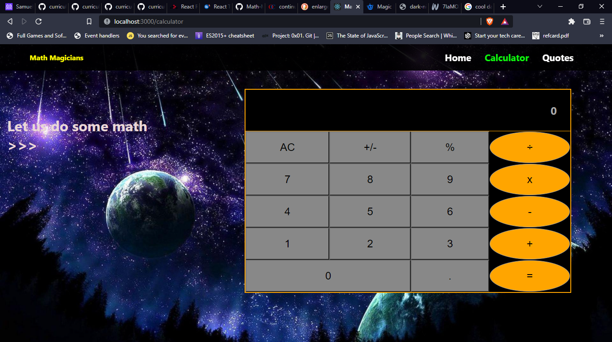

# Math Magicians
This branch is the first step of the Math Magicians application. In this branch the environment and tools needed to develop a React application are setted up. In the following stepss, the actual application will be developed.



## Built With
- React
This project was bootstrapped with [Create React App](https://github.com/facebook/create-react-app).
## Getting Started

**step1** cloning the project:
```
git clone https://github.com/AckonSamuel/math-magician.git
```
**step2** cd into the math-magician directory:
```
cd <Relative path>/math-magician
```

**step3** install dependencies:
```
npm i
```

**step4** build the project:
```
npm run build
```

**step2** deploy project to localhost://3000:
```
npm start
```
## Available Scripts

In the project directory, you can run:

### `npm start`

Runs the app in the development mode.\
Open [http://localhost:3000](http://localhost:3000) to view it in your browser.

The page will reload when you make changes.\
You may also see any lint errors in the console.

### `npm test`

Launches the test runner in the interactive watch mode.\
See the section about [running tests](https://facebook.github.io/create-react-app/docs/running-tests) for more information.

### `npm run build`

Builds the app for production to the `build` folder.\
It correctly bundles React in production mode and optimizes the build for the best performance.

The build is minified and the filenames include the hashes.\
Your app is ready to be deployed!

## Author
**Ackon Samuel**
- GitHub: [@githubhandle](https://github.com/AckonSamuel)
- Twitter: [@twitterhandle](https://twitter.com/AckonSamuel2)

## Contributing

Contributions, issues, and feature requests are welcome!

Feel free to check the [issues page](../../issues/).

## Show your support

Give a ⭐️ if you like this project!

## License

This project is [MIT](./MIT.md) licensed.
